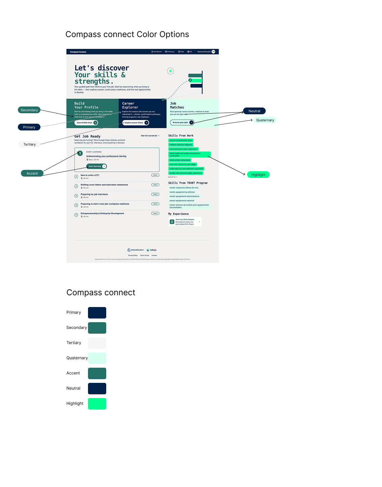

# Compass Connect Customisation Guide

This guide documents which parts of a Compass Connect deployment can be customised.
All options are defined in [`config/default.json`](default.json), which is the source of truth for available settings.

The configuration is organized into the following sections:

- **branding** — Application name, logos, colors, illustrations, and SEO metadata
- **auth** — Authentication behavior
- **cv** — CV feature availability
- **skillsReport** — Skills report branding, formats, and content
- **i18n** — Language and locale settings
- **analytics** — Google Analytics 4 and Google Tag Manager integration
- **faq** — Tutorial video URL
- **sensitiveData** — User data collection fields

Only options exposed in these sections are customizable. Core application logic, workflows, and page layouts are fixed.

## App Name & Tab Title

- `branding.appName` — name displayed throughout the application
- `branding.browserTabTitle` — text shown in the browser tab

## SEO Metadata

- `branding.metaDescription` — search engine description
- `branding.seo.name` — site name for search results
- `branding.seo.url` — public application URL
- `branding.seo.image` — image used for social sharing
- `branding.seo.description` — detailed SEO description

## Logos & Icons

Place assets in `frontend-new/public/` and reference them as `/filename.ext`,
or use a full URL to an externally hosted asset.

- `branding.assets.logo` — main logo
- `branding.assets.darkLogo` — logo variant used on light backgrounds
- `branding.assets.favicon` — browser tab icon
- `branding.assets.appIcon` — app icon (mobile / PWA)
- `branding.assets.chatAvatar` — AI assistant avatar shown in the chat interface

`branding.partnerLogos` is a list of partner logos shown in the footer.
Each entry takes `src`, `alt`, and optional `width` / `height`.

## Illustrations

`branding.illustrations` controls the images shown across key pages.
Each value can be a plain path (`"/image.ext"`) or an object with `src`, `width`, and `height`
when you also want to control the display size.

- `loginHero` — large hero image on the login page
- `loginFeature1`, `loginFeature2`, `loginFeature3` — three feature images on the login page
- `homeHero` — hero image on the home page
- `homeHeroIllustrationPosition` — `center` or `edge`, controls the hero alignment
- `careerReadinessHero` — hero image on the career readiness page
- `authShapesBackground` — decorative background pattern on auth pages
- `dashboardShapesBackground` — decorative background pattern on the dashboard

## Colors

The application has seven brand colors. Each controls a specific region of the UI.



All color keys live under `branding.theme` in the config file.
colors are defined as space-separated RGB values, for example `"0 255 145"`.
This format lets the application generate transparency variants automatically.

- `brand-primary` — primary action buttons and key interactive elements
- `brand-secondary` — section headers and feature cards
- `brand-tertiary` — subtle backgrounds and lower-emphasis areas
- `brand-quaternary` — specific card backgrounds
- `brand-accent` — tag chips and inline highlights
- `brand-neutral` — navigation bar
- `brand-highlight` — skill tags and programme chips

Each color supports four variants by appending a suffix:
`(none)` for the main value, `-light`, `-dark`, and `-contrast-text`.
If only the main value is set the others are derived automatically.

After changing colors, verify text contrast meets WCAG AA
(4.5 : 1 for body text, 3 : 1 for large text) using the
[WebAIM Contrast Checker](https://webaim.org/resources/contrastchecker/).

## Languages & Translations

### Enabling Languages

- `i18n.ui.defaultLocale` — language that loads by default
- `i18n.ui.supportedLocales` — list of languages shown in the language switcher
- `i18n.conversation.default_locale` — default language for the AI conversation
- `i18n.conversation.available_locales` — languages available for the AI conversation

### Adding or Translating a Language

To add a new language or update existing translations, see the [Language Guide](../add-a-new-language.md).

## Authentication

- `auth.disableLoginCode` — remove the login code requirement
- `auth.disableRegistrationCode` — remove the registration code requirement
- `auth.disableRegistration` — make the app login-only (hides the register flow entirely)
- `auth.disableSocialAuth` — hide social login options such as Google sign-in

## Legal Documents

Legal documents are matched to the deployment automatically using `branding.appName` (case-insensitive).

To add documents for a new deployment:

1. Add two Markdown files to `frontend-new/src/legal/documents/`:
   - `privacy-policy-{product-slug}.md`
   - `terms-of-use-{product-slug}.md`
2. Register them in `frontend-new/src/legal/legalDocumentLoader.ts` under `documentsByProductName`.

If no match is found the app falls back to the default documents.

## Features

### CV Upload

`cv.enabled` controls whether CV functionality is available in the application.
Set to `true` to enable or `false` to disable.
When disabled, all CV-related UI elements are hidden and CV APIs are not registered.

### Skills Report

- `skillsReport.logos` — one or more logos displayed in generated reports (supports separate sizing for DOCX and PDF)
- `skillsReport.downloadFormats` — available download formats: `pdf`, `docx`, or both
- `skillsReport.report.summary.show` — show or hide the summary section
- `skillsReport.report.experienceDetails.title` — show or hide the experience title
- `skillsReport.report.experienceDetails.companyName` — show or hide the company name
- `skillsReport.report.experienceDetails.dateRange` — show or hide the date range
- `skillsReport.report.experienceDetails.location` — show or hide the location

## Analytics

Compass Connect supports Google Analytics 4 (GA4) via Google Tag Manager (GTM).

- `analytics.enabled` — enable or disable tracking in the frontend
- `analytics.gtmContainerId` — GTM container ID (for example `GTM-XXXXXXX`)
- `analytics.ga4PropertyId` — GA4 property ID
- `analytics.ga4MeasurementId` — GA4 measurement ID (for example `G-XXXXXXX`)

For full setup, see the [Analytics Setup Guide](ANALYTICS_SETUP.md).

## Data Collection Fields

`sensitiveData.fields` configures the personal data form shown to users after registration.
Each field supports visibility, required/optional, type (free text or choices), validation, and per-language labels.

For the full schema and examples, see the
[Sensitive Data Fields Configuration Guide](../frontend-new/sensitive-data-fields-config.md).

## FAQ Video

`faq.tutorialVideoUrl` — URL of the tutorial video embedded in the FAQ page.

## Applying Changes Locally

1. Copy `config/default.json` and give it a name that reflects your deployment (for example `config/connect.json`).
2. Update the values in your new file. Only the values you change need to be included — anything not specified falls back to the defaults in `default.json`.
3. Navigate to the `config` directory and run the inject script:

```bash
cd config
python3 inject-config.py --config connect.json
```

This injects values into the backend `.env` file and the frontend `public/data/env.js` file.

To apply only specific sections:

```bash
python3 inject-config.py --config connect.json --namespaces branding auth
```

4. Restart the frontend and backend to pick up the new values.

## Configuration Reference

Refer to [default.json](default.json) for the complete configuration structure and all supported options.

## Important Notes

- If a configuration value is missing or contains a typo, the application will fall back to its default value
- If changes do not appear after deployment, verify the injected environment variables
- Configuration keys must match the structure in **default.json** exactly
